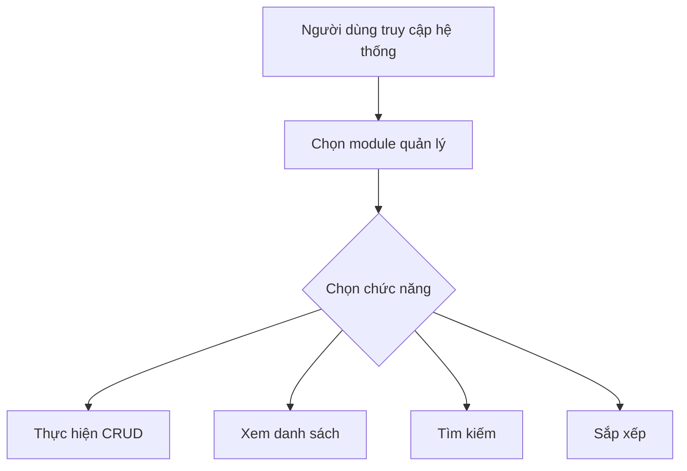

# Tên Dự Án: Hệ Thống Quản Lý Khóa Học

## Được Phát Triển Bởi:
- [Phạm Hoàng Anh]


## Mô Tả Ứng Dụng
Hệ thống quản lý khóa học là một ứng dụng web giúp quản lý các khóa học, giảng viên và sinh viên một cách hiệu quả. Ứng dụng cung cấp các chức năng CRUD (Tạo, Đọc, Sửa, Xóa) cho các đối tượng chính: Khóa học, Giảng viên và Sinh viên.

## Mục Đích
- Quản lý thông tin các khóa học
- Quản lý thông tin giảng viên và sinh viên
- Cung cấp giao diện người dùng dễ sử dụng
- Hiển thị dữ liệu hiệu quả thông qua DataTables
- Quản lý profile người dùng
- Quản lý Đăng ký

## Công Nghệ
Dự án sử dụng các công nghệ sau:
- Laravel Framework (cập nhật lên phiên bản mới nhất)
- PHP 8.x
- MySQL - Aiven
- DataTables với jQuery
- AdminLTE 3.x (giao diện admin)
- HTML, CSS, JavaScript
- Laravel Repository Pattern
- Laravel Service Pattern
- Laravel Events & Listeners

## Quá Trình Phát Triển Phần Mềm

### Sơ Đồ Khối (UML) - Cấu trúc Database
```mermaid
classDiagram
    class User {
        +int id
        +string name
        +string email
        +string password
        +string remember_token
    }

    class Teacher {
        +int id
        +string name
        +string email
        +string phone
        +timestamps created_at
        +timestamps updated_at
    }

    class Student {
        +int id
        +string name
        +string email
        +string phone
        +timestamps created_at
        +timestamps updated_at
    }

    class Course {
        +int id
        +string name
        +text description
        +date start_date
        +date end_date
        +timestamps created_at
        +timestamps updated_at
    }

    class Enrollment {
        +int id
        +int course_id
        +int student_id
        +timestamps created_at
        +timestamps updated_at
    }

    %% Quan hệ giữa các bảng
    Course --> Teacher : "1" belongsTo "1"
    Teacher --> Course : "1" hasMany "*"
    Student --> Enrollment : "1" enrolls "*"
    Enrollment --> Course : "*" belongsTo "1"
    User <|-- Teacher : "1:1"
    User <|-- Student : "1:1"
```
### Sơ Đồ Cấu Trúc Project - Nâng Cấp

```mermaid
flowchart TD
    A[Project Root] --> B[app]
    A --> C[resources]
    A --> D[database]
    A --> E[config]
    A --> F[public]
    A --> G[routes]
    A --> H[tests]
    A --> I[storage]
    A --> J[bootstrap]

    B --> B1[Models]
    B --> B2[Http]
    B --> B3[Providers]
    B --> B4[Console]

    B1 --> B1a[Course]
    B1 --> B1b[Teacher]
    B1 --> B1c[Student]

    B2 --> B2a[Controllers]
    B2 --> B2b[Middleware]
    B2 --> B2c[Requests]

    C --> C1[views]
    C --> C2[lang]
    C --> C3[js]
    C --> C4[css]

    D --> D1[migrations]
    D --> D2[seeds]
    D --> D3[factories]

    E --> E1[app.php]
    E --> E2[database.php]
    E --> E3[mail.php]

    F --> F1[css]
    F --> F2[js]
    F --> F3[images]

    G --> G1[web.php]
    G --> G2[api.php]

    H --> H1[Feature]
    H --> H2[Unit]

    I --> I1[logs]
    I --> I2[framework]
    I --> I3[app]

    J --> J1[cache]
    J --> J2[app.php]
```


### Sơ Đồ Chức Năng (Sơ Đồ Thuật Toán)



## Chu Trình Phát Triển
1. Phases:
    - Analysis: Phân tích yêu cầu và thiết kế database
    - Design: Áp dụng các design patterns (Repository, Service)
    - Implementation: Viết code theo các patterns đã thiết kế
    - Testing: Unit tests, Feature tests
    - Deployment: CI/CD pipeline

## Deployment
1. Cài đặt môi trường
   ```bash
   composer create-project laravel/laravel course-management
   cd course-management
   ```

2. Tạo database
   ```sql
   CREATE DATABASE course_management;
   ```

3. Configure .env
   ```
   DB_CONNECTION=mysql
   DB_HOST=127.0.0.1
   DB_PORT=3306
   DB_DATABASE=course_management
   DB_USERNAME=root
   DB_PASSWORD=
   ```

4. Install dependencies
   ```bash
   composer require yajra/laravel-datatables-oracle
   npm install admin-lte@3.1.0
   ```

5. Run migrations
   ```bash
   php artisan migrate
   php artisan db:seed
   ```

6. Deploy to server
   ```bash
   php artisan serve
   ```

## Lưu ý về cải tiến cấu trúc
- Áp dụng Repository Pattern giúp tách biệt logic truy cập dữ liệu từ controllers
- Service Layer chứa business logic, giúp code dễ test và bảo trì
- Request Validation giúp tách biệt logic validation
- API Resources chuẩn hóa dữ liệu trả về
- Events & Listeners xử lý các tác vụ phụ không đồng bộ

## Public Link
[Link đến ứng dụng đã deploy]()
